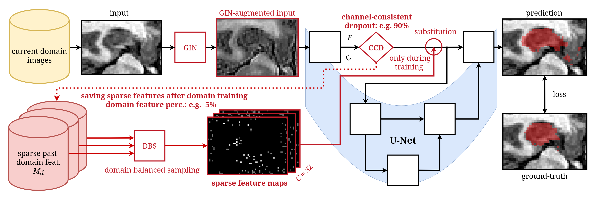

# FOCUS: Feature Replay with Optimized Channel-Consistent Dropout for U-Net Skip-Connections

[](https://conferences.miccai.org/2025/en/)
[]()
[](https://www.python.org/downloads/release/python-390/)
[](https://developer.nvidia.com/cuda-toolkit)



## Abstract

This repository contains the official implementation of **FOCUS** (Feature Replay with Optimized Channel-Consistent Dropout for U-Net Skip-Connections), a continual learning method for medical image segmentation across domain shifts. Unlike existing feature replay approaches that sacrifice U-Net skip-connections, FOCUS preserves these essential connections while maintaining privacy constraints and storage efficiency. Our method combines strong domain generalization techniques (GIN) with sparse feature replay using domain-balanced sampling (DBS), where sparsity is induced via channel-consistent dropout (CCD). 

## 📝 Citation

If you find this work useful in your research, please consider citing our paper:

```bibtex
@inproceedings{Joham25-FOCUS,
    author = {Joham, Simon Johannes and Thaler, Franz and Hadzic, Arnela and Urschler, Martin},
    title = {{FOCUS: Feature Replay with Optimized Channel-Consistent Dropout for U-Net Skip-Connections}},
    booktitle = {International Conference on Medical Image Computing and Computer Assisted Intervention (MICCAI) 2025, Daejeon, South Korea},
    pages = {accepted, in press},
    year = {2025},
}
```

## 🛠️ Installation and Setup

### Prerequisites

- Python 3.9.20
- CUDA Toolkit 12.4
- PyTorch (compatible with CUDA 12.4)

**Note:** The implementation may not work with newer versions due to dependency constraints.

### Environment Setup

Follow the comprehensive setup instructions from the lifelong nnU-Net framework:

1. Refer to [README_Lifelong-nnUNet.md](README_Lifelong-nnUNet.md) for detailed installation steps
2. Original implementation based on: [Lifelong-nnUNet Repository](https://github.com/MECLabTUDA/Lifelong-nnUNet/tree/cl_vae)

### Dataset Preprocessing

Detailed dataset preprocessing instructions are available at:
[Lifelong-nnUNet Preprocessing Guide](https://github.com/MECLabTUDA/Lifelong-nnUNet/tree/cl_vae)

**Data Splits:** Use the provided `create_3_split.py` script to generate train/validation/test splits. The following commands assume consistent task IDs across experiments.

## 🚀 Training

### FOCUS Method

The `-layer_name` parameter defines the encoder layer for feature extraction and parameter freezing. Note that FOCUS internally uses only first-level encoder features for replay, regardless of the specified extraction layer. This parameter maintains compatibility with the underlying framework while allowing proper encoder freezing configuration. We always set it to the network bottleneck.

#### Hippocampus Dataset

```bash
# Sequential baseline (GIN)
nnUNet_train_sequential_GIN 2d -t 197 198 199 -f 0 -num_epoch 250 -save_interval 25 -s seg_outputs --store_csv -d 0 --exp_name seq_GIN

# FOCUS method
nnUNet_train_FOCUS 2d -t 197 198 199 -f 0 -num_epoch 250 -save_interval 25 -s seg_outputs --store_csv -layer_name conv_blocks_context.3 -num_samples_in_perc 1.0 -d 0 -seed 1 -CCD 0.9 -DFP 0.05 --exp_name focus
```

#### Prostate Dataset

```bash
# Sequential baseline (GIN)
nnUNet_train_sequential_GIN 2d -t 111 112 113 115 -f 0 -num_epoch 250 -save_interval 25 -s seg_outputs --store_csv -d 0 --exp_name seq_GIN

# FOCUS method
nnUNet_train_FOCUS 2d -t 111 112 113 115 -f 0 -num_epoch 250 -save_interval 25 -s seg_outputs --store_csv -layer_name conv_blocks_context.6 -num_samples_in_perc 1.0 -d 0 -seed 1 -CCD 0.9 -DFP 0.05 --exp_name focus
```

### Baseline Methods from Literature

<details>
<summary><strong>Hippocampus Baselines</strong></summary>

```bash
# Single domain models
nnUNet_train_sequential 2d -t 197 -f 0 -num_epoch 250 -save_interval 25 -s seg_outputs --store_csv -d 0 --exp_name seq
nnUNet_train_sequential 2d -t 198 -f 0 -num_epoch 250 -save_interval 25 -s seg_outputs --store_csv -d 0 --exp_name seq
nnUNet_train_sequential 2d -t 199 -f 0 -num_epoch 250 -save_interval 25 -s seg_outputs --store_csv -d 0 --exp_name seq

# Continual learning baselines
nnUNet_train_sequential 2d -t 197 198 199 -f 0 -num_epoch 250 -save_interval 25 -s seg_outputs --store_csv -d 0 --exp_name seq
nnUNet_train_ewc 2d -t 197 198 199 -f 0 -num_epoch 250 -save_interval 25 -s seg_outputs --store_csv -d 0 --exp_name ewc
nnUNet_train_mib 2d -t 197 198 199 -f 0 -num_epoch 250 -save_interval 25 -s seg_outputs --store_csv -d 0 --exp_name mib
nnUNet_train_TED 2d -t 197 198 199 -f 0 -num_epoch 250 -save_interval 25 -s seg_outputs --store_csv -d 0 -ted_lambda 1e-3 --exp_name ted_1e-3
nnUNet_train_vae_rehearsal_no_skips_condition_on_both 2d -t 197 198 199 -f 0 -num_epoch 250 -save_interval 25 -s seg_outputs --store_csv -d 0 1 -layer_name conv_blocks_context.3 -num_samples_in_perc 1.0 --exp_name ccVAE
```

</details>

<details>
<summary><strong>Prostate Baselines</strong></summary>

```bash
# Single domain models
nnUNet_train_sequential 2d -t 111 -f 0 -num_epoch 250 -save_interval 25 -s seg_outputs --store_csv -d 0 --exp_name seq
nnUNet_train_sequential 2d -t 112 -f 0 -num_epoch 250 -save_interval 25 -s seg_outputs --store_csv -d 0 --exp_name seq
nnUNet_train_sequential 2d -t 113 -f 0 -num_epoch 250 -save_interval 25 -s seg_outputs --store_csv -d 0 --exp_name seq
nnUNet_train_sequential 2d -t 115 -f 0 -num_epoch 250 -save_interval 25 -s seg_outputs --store_csv -d 0 --exp_name seq

# Continual learning baselines
nnUNet_train_sequential 2d -t 111 112 113 115 -f 0 -num_epoch 250 -save_interval 25 -s seg_outputs --store_csv -d 0 --exp_name seq
nnUNet_train_ewc 2d -t 111 112 113 115 -f 0 -num_epoch 250 -save_interval 25 -s seg_outputs --store_csv -d 0 --exp_name ewc
nnUNet_train_mib 2d -t 111 112 113 115 -f 0 -num_epoch 250 -save_interval 25 -s seg_outputs --store_csv -d 0 --exp_name mib
nnUNet_train_TED 2d -t 111 112 113 115 -f 0 -num_epoch 250 -save_interval 25 -s seg_outputs --store_csv -d 0 -ted_lambda 1e-1 --exp_name ted_1e-1
nnUNet_train_vae_rehearsal_no_skips_condition_on_both 2d -t 111 112 113 115 -f 0 -num_epoch 250 -save_interval 25 -s seg_outputs --store_csv -d 0 1 -layer_name conv_blocks_context.6 -num_samples_in_perc 1.0 --exp_name ccVAE
```

</details>

## 📊 Evaluation

Execute the comprehensive evaluation script:

```bash
nnUNet_evaluate_all
```

### Results Location

After completion, results will be organized in your designated `nnUNet_EVALUATION_FOLDER`:

- **Aggregated Results:** `aggregated_summaries/` containing overall AVG, BWT, and FWT metrics
- **Detailed Results:** `nnUNet_ext/2d/` contains predictions of all dataset samples and domain performance metrics
- **Forward Transfer (FWT):** Requires single domain models trained with `nnUNet_train_sequential` and experiment name `seq`

## 📈 Key Parameters

| Parameter | Description                                                                   | Default Values |
|-----------|-------------------------------------------------------------------------------|----------------|
| `CCD` | Channel-Consistent Dropout rate                                               | 0.9 |
| `DFP` | Domain Feature Percentage                                                     | 0.05 |
| `num_samples_in_perc` | Percentage of overall samples (volumes) for replay. For legacy compatibility. | 1.0 |
| `layer_name` | Freezing and feature extraction point for encoder layers                      | Dataset-dependent |

## 📜 License

Please refer to the license information provided with the original lifelong nnU-Net framework.

## 🙏 Acknowledgments

This work builds upon the excellent [Lifelong-nnUNet](https://github.com/MECLabTUDA/Lifelong-nnUNet) framework. We thank the authors for making their code publicly available.

---

**Contact:** For questions or issues, please open a GitHub issue or contact the corresponding author.